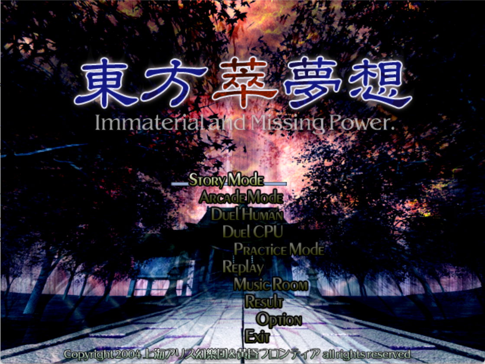
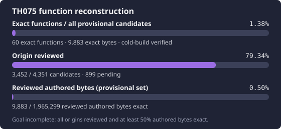

# 東方萃夢想 ～ Immaterial and Missing Power

<p align="center">
  
</p>

<p align="center">
  
</p>

This project currently covers **function-level source reconstruction and byte
comparison**, using the Bash + Ghidra MCP workflow from TH095.

The target is the user-supplied Japanese `th075.exe`, which reports `ver1.11`:

| Property | Pinned value |
| --- | --- |
| File size | 2,576,384 bytes |
| SHA-256 | `bd441e99075436e8dcad26f86ffcf5e6aac4f58b0ed3ee7442e4cb39d8e22c98` |
| MD5 | `21bcb855a39f2170195811e6ad292f18` |
| Image base | `0x00400000` |
| Entry point | `0x0064232C` |
| `.text` virtual extent | `0x00401000..0x00656F0E` |

This pins the supplied sample; its official distribution provenance has not
been independently corroborated. The localized `th075c.exe` has a different
identity and cannot substitute for the target.

Ghidra analysis found 4,351 provisional function candidates. 60
functions have reconstructed source and complete exact matches covering 9,883
bytes, including reviewed switch tables. Names remain inferred. Candidate
count is not the number of confirmed authored functions. Scripts and the `config/` ledgers report current state.

At the R126 checkpoint, origin review has classified 919 authored,
1,733 library and 575 compiler-generated candidates; 1,124 remain pending.
The reviewed authored-byte slice is 9,883 / 1,965,299 exact (0.50%), with a
provisional denominator. R108 resolved one destructor and retained five
explicit/implicit lifetime ambiguities; R109 resolved thirteen game policies.
R110 resolves six deque dependencies and their complete range-erase callee
through independently reviewed game policies and a cold source-typed graph.
R111 resolves five range erases, four single-erase wrappers and three iterator
helpers through complete, closed source graphs with 337 cold source alternatives.
R112 resolves six postfix increments through their actual typed prefix callees
and two complete game callers. R113 resolves five queue helpers and the
unique enqueue/main-loop policies. R114 resolves four shared-lifetime/callback
policies and retains a complete ordinary/generated initializer ambiguity;
its CRT entry remained pending until the complete R126 graph closed. R115 resolves the
complete heap initialization graph and vendor SEH epilog, retaining unresolved
error, handler and multibyte chains. R116 resolves dynamic exit/message-box
dispatch and the complete shared-copy entry while preserving unresolved cookie
failure chains. R117 resolves the cookie initializer and complete SEH/NLG
dependencies, retaining unresolved user-handler and termination chains.
R118 resolves complete static locks, dynamic critical-section dispatch and
the callback loop, retaining allocator/TLS and shared-cleanup uncertainty.
R119 resolves six complete small-block/new-handler/TLS dependencies while
retaining the allocator/lock/error cycle. R120 closes the complete allocator/
lock/error/termination graph through eighteen whole source bodies and five
existing interior labels. R121 resolves the complete onexit/heap-growth/
teardown graph and retains two startup parents until locale and FP
dependencies close. R122 closes five complete locale/thread roots and the
whole fiber cleanup control, while multibyte initialization remains pending.
R123 closes the six multibyte/codepage roots and nine necessary NLS/locale
callees, including three full cleanup extents and three existing interior labels.
R124 closes 27 complete floating-point conversion/control bodies. R125 closes
all six initializer roots and the necessary exception/signal graph, including
cinit's actual callbacks and one existing raise cleanup label. R126 closes
eleven complete environment/argv/exception/exit bodies, including the full
PE entry and its independently authored game callee. The next handoff targets
six R127 floating-point dispatch candidates while preserving
the 60-function exact baseline.
The complete-origin and 50%-exact milestones are unfinished. See the
[current handoff](docs/RE_HANDOFF.md) and
[origin review journal](docs/ORIGIN_REVIEW.md).

## Getting started

Use `scripts/repo-python` for repository Python commands and Web MCP Bash
requests. Bootstrap the isolated Python 3.12 environment with
`scripts/bootstrap-python.sh`; Capstone 5.0.6 bindings and its native decoder
are hash-checked before every invocation. No activation is needed.
Build, comparison, Ghidra, and CI scripts use this entry point for their Python
child processes as well, preserving the same isolated environment throughout.

Private symlinks currently reuse TH095's installed tool binaries. TH075 has
its own bridge checkout, Ghidra project, and output directories. Recreate the
tool environment with:

```bash
scripts/bootstrap-tools.sh /path/to/th095
scripts/repo-python scripts/import-target.py /path/to/th075.exe
```

`import-target.py` also accepts an executable path and imports only the pinned
hash. Game files are ignored by Git. Run `scripts/repo-python scripts/ghidra.py import` only
to create a new project and initial candidate ledgers. For the existing project,
use `check` instead of importing again.

Start each reconstruction session with:

```bash
scripts/repo-python scripts/check-tools.py
scripts/repo-python scripts/verify-target.py
scripts/repo-python scripts/validate-tracking.py --require-target
scripts/repo-python scripts/report-reconstruction-status.py --summary
scripts/repo-python scripts/ghidra.py check
```

Cold-build and replay the first accepted function:

```bash
scripts/repo-python scripts/replay-exact-units.py --unit graphics-resource-client-constructor
```

Replay all configured functions with `scripts/repo-python scripts/replay-exact-units.py`.
See [toolchain and matching details](docs/BUILD_MATCHING.md).
Run public checks with `scripts/repo-python scripts/ci.py`; these do not require the game
executable or private Ghidra project.

## Bash + Ghidra MCP

`.tools/mcp_for_gptweb-ghidra` is pinned to TH095's `ghidra-bash` bridge commit
`60e18377b558fb62451230a393cd6a37f947a3f9`. It exposes only `run_command` and
`ghidra_call`. Every Ghidra request passes through this repository's
`scripts/ghidra.py`.

The deployed user service uses its own fixed private Funnel URL on HTTPS 443,
loopback port 8775, and **no authentication**. Requests do not need an
Authorization header. The random path is stored in the ignored
`.tools/mcp_for_gptweb-ghidra/.env` with mode 600, not in repository documents.
Keep that file stable across restarts. The example is for a new deployment.

Operate and test the existing service with:

```bash
systemctl --user status th075-ghidra-bash-mcp.service --no-pager
systemctl --user restart th075-ghidra-bash-mcp.service
scripts/repo-python scripts/test-public-mcp.py
```

Public tests passed through a global IPv4 Funnel ingress with TLS validation,
including access without authentication, both tools, Ghidra attestation/decompilation, failed
request handling, scratch cleanup, and a cold exact function replay. The
service is enabled, user lingering is active, and all six existing Funnel
handlers were preserved. See [deployment details](docs/GHIDRA_MCP.md).

## Documentation and references

See the [function workflow](docs/RE_WORKFLOW.md),
[TH095 reference investigation](docs/TH095_REFERENCE.md),
[accepted evidence](docs/KNOWLEDGE_BASE.md), and
[current handoff](docs/RE_HANDOFF.md).

The [TH095 reconstruction](https://github.com/N0zoM1z0/th095) supplies the
Bash + Ghidra bridge and VC7.1 comparison workflow. The
[TH08 reconstruction](https://github.com/N0zoM1z0/th08) supplies additional
function-matching patterns. The
[TH105 reconstruction](https://github.com/N0zoM1z0/th105) provides a related
engine reference for rendering, input, and ownership investigations.
See the [reference comparison](docs/REFERENCE_PROJECTS.md).
Their source and engine layouts are supporting
references; acceptance depends on the pinned TH075 target.

Regenerate the progress card with `scripts/repo-python scripts/update-progress.py` after
updating the ledgers. The function-count bar includes all provisional candidates;
the authored-byte bar uses only the reviewed authored slice and stays marked
provisional until all origins are reviewed.

## License

Repository code and documentation are available under the [MIT license](LICENSE).
The game and the supplied title-screen artwork retain their original copyrights.
No game executable, game data archive, downloaded toolchain, analysis database,
or private MCP endpoint is distributed here.
